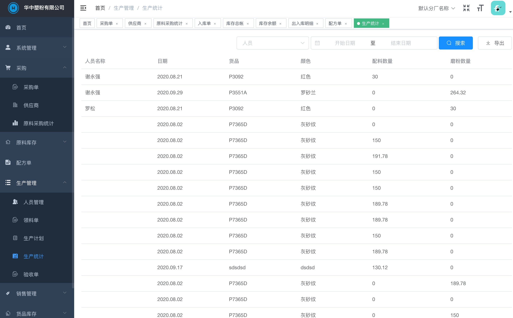

# erp
企业资源管理系统

### 项目总述
* 支持生产加工型企业日常管理所需功能；
* 支持仓管在原来功能基础上升级WMS(仓库管理系统+自动化);
* 支持描码枪设备录入；

### 定制服务
* 如有ERP、WMS 定制需求, 请与业务人员详谈QQ：55720091

### 主要功能
* 首页

* 采购单

* 供应商

* 原料采购统计

* 入库单

* 库存总帐

* 出入库明细

* 配方单

* 配方单比例

* 配方单成本

* 配方单比较

* 生产计划

* 生产统计

* 验收单

* 销售回款

### 技术框架
* 核心框架：SpringBoot 2.2.7
* 持久层框架：Mybatis 3.5.5, mybatis-plus 3.4.0
* Migration: liquibase
* 日志管理：Logback 1.2.3
* 前端框架：vue2.6.10, Element-ui 2.13.0
* 数据库: mysql 5.7+

